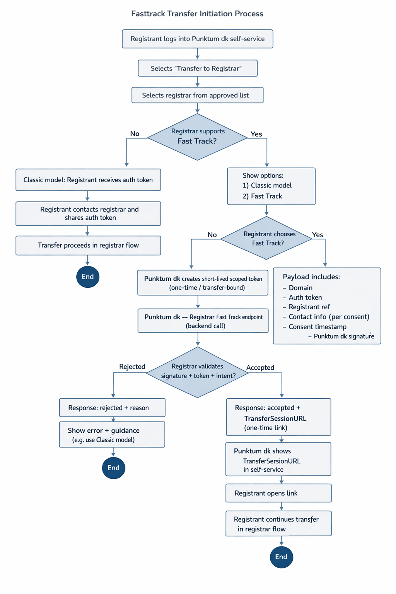

# Fast Track Transfer Initiation Process

# Purpose

To reduce complexity for the registrant while increasing security by allowing the auth token to be distributed system-to-system instead of via the end user.

The model does not change the transfer rules themselves, but rather the way the transfer is initiated.

---

# Overall Principle

The auth token is treated as a technical authorization artifact that Punktum dk can securely transport on behalf of an authenticated registrant, rather than requiring the token to be handled manually by the user.

The existing model, where the registrant receives and shares the token themselves, is retained as a fallback.

---

# User Flow (From the Registrant’s Perspective)

1. The registrant logs into Punktum dk’s self-service portal.
2. The registrant selects **“Transfer domain to registrar”**.
3. The registrant selects a registrar from a list of approved registrars.
4. If the registrar supports fast track, the registrant is presented with two options:
   - Contact the registrar manually using the auth token (classic model), or
   - Request Punktum dk to initiate the transfer directly with the registrar (fast track).
5. If fast track is selected, the registrant provides consent for Punktum dk to share:
   - Domain name  
   - Auth token  
   - Relevant contact information  

   with the selected registrar for the purpose of initiating the transfer process.

---

# Technical Interaction (Punktum dk → Registrar)

Once the registrant has provided consent, Punktum dk performs a backend call to the registrar’s fast track endpoint.

### Example Payload (Illustrative)

- Domain name  
- Auth token (short-lived and tied to this specific transfer intention)  
- Registrant reference  
- Contact information (in accordance with consent)  
- Timestamp of consent  
- Signature from Punktum dk  

In this model, the auth token will be:

- Short-lived  
- One-time use or scope-bound to the specific transfer  
- Invalid outside this context  

---

# Registrar Response

The registrar confirms receipt and returns a unique link representing a created transfer session at the registrar.

### Example Response

- Status (accepted / rejected)  
- `TransferSessionURL` (one-time link)  

Punktum dk then presents this link to the registrant in the self-service portal, allowing the registrant to continue directly in the registrar’s transfer flow.

---

# Security Considerations

This model reduces the exposure of auth tokens, as they are not distributed via email or manual copying. The token is transferred exclusively system-to-system between Punktum dk and the registrar.

Punktum dk remains a neutral party and solely facilitates the technical initiation of the transfer following the registrant’s explicit request.

---

# Requirements for Registrars Supporting Fast Track

Registrars wishing to participate must, via the registrar portal:

- Enable **“Fast Track Transfer”**
- Provide a technical endpoint for receiving transfer intents
- Register required security information (e.g., keys/certificates)
- Specify any timeout and handling rules

Only registrars that have actively opted in will be displayed as fast track–supporting in the self-service portal.

---

# Fallback

If a registrar does not support fast track, the existing model applies, where the registrant receives and shares the auth token manually.
