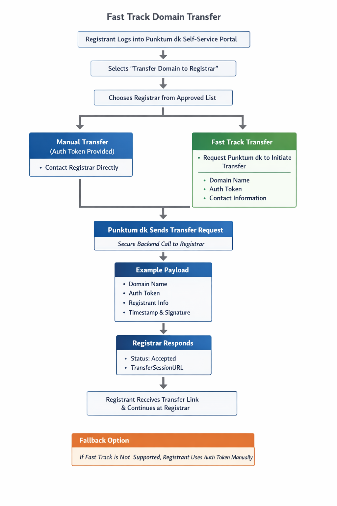

# Fast Track Transfer Initiation Process

## Introduction

To reduce complexity for the registrant while increasing security by allowing the auth token to be distributed system-to-system instead of via the end user.

The model does not change the transfer rules themselves, but rather the way the transfer is initiated.

## Document History

26-02-2026 Initial draft version published

## Overall Principle

The auth token is treated as a technical authorization artifact that Punktum dk can securely transport on behalf of an authenticated registrant, rather than requiring the token to be handled manually by the user.

The existing model, where the registrant receives and shares the token themselves, is retained as a fallback.

## User Flow (From the Registrant’s Perspective)



1. The registrant logs into Punktum dk’s self-service portal.
2. The registrant selects **“Transfer domain to registrar”**.
3. The registrant selects a registrar from a list of approved registrars.
4. If the registrar supports fast track, the registrant is presented with two options:
   - Contact the registrar manually using the auth token (classic model), or
   - Request Punktum dk to initiate the transfer directly with the registrar (fast track).
5. If fast track is selected, the registrant provides consent for Punktum dk to share:
   - Domain name  
   - Auth token  
   - Relevant contact information  

   with the selected registrar for the purpose of initiating the transfer process.


## Technical Interaction (Punktum dk → Registrar)

Once the registrant has provided consent, Punktum dk performs a backend call to the registrar’s fast track endpoint.

### API key
If the registrar defines API key to use in Fast Track transfer configuration, this will be passed as X-API-KEY header in the request.

### Example Payload

- Domain name  
- Auth token (short-lived and tied to this specific transfer intention)  
- Registrant reference  
- Contact information (in accordance with consent)  
- Timestamp of consent  

In this model, the auth token will be:

- Short-lived  

Below is an example of a fast-track transfer request supporting multiple domains for a single contact. Each domain includes its own auth token.

```json
{
  "contact": {
    "name": "Jane Doe",
    "email": "jane.doe@example.com",
    "phone": "+4512345678",
    "address": {
      "street": "Example Street 12",
      "zip": "2100",
      "city": "Copenhagen",
      "country": "DK"
    }
  },
  "consent": {
    "granted_at": "2026-04-17T11:55:00Z",
    "ip_address": "203.0.113.42"
  },
  "domains": [
    {
      "domain_name": "example.dk",
      "auth_token": {
        "value": "token-domain-1",
        "expires_at": "2026-04-17T12:00:00Z",
        "scope": "transfer"
      }
    },
    {
      "domain_name": "example2.dk",
      "auth_token": {
        "value": "token-domain-2",
        "expires_at": "2026-04-17T12:00:00Z",
        "scope": "transfer"
      }
    },
    {
      "domain_name": "example3.dk",
      "auth_token": {
        "value": "token-domain-3",
        "expires_at": "2026-04-17T12:05:00Z",
        "scope": "transfer"
      }
    },
    {
      "domain_name": "example4.dk",
      "auth_token": {
        "value": "token-domain-4",
        "expires_at": "2026-04-17T12:10:00Z",
        "scope": "transfer"
      }
    },
    {
      "domain_name": "example5.dk",
      "auth_token": {
        "value": "token-domain-5",
        "expires_at": "2026-04-17T12:15:00Z",
        "scope": "transfer"
      }
    }
  ]
}
```

## Registrar Response

The registrar confirms receipt and returns a unique link representing a created transfer session at the registrar.

- Use standard HTTP headers to communicate status (200 for OK and 4xx and 5xx for errors)
- Required transfer_session_url containing link to transfer flow at registrar
- Optional expires_at timestamp Punktum dk can display to the registrant when the link will expire

### Example Response
```json
{
  "transfer_session_url": "https://example.dk/transfer/session/e125dec7170048378528a664a1c25d1b",
  "expires_at": "2026-04-17T12:15:00Z"
}
```

Punktum dk then presents this link to the registrant in the self-service portal, allowing the registrant to continue directly in the registrar’s transfer flow.

## Security Considerations

This model reduces the exposure of auth tokens, as they are not distributed via email or manual copying. The token is transferred exclusively system-to-system between Punktum dk and the registrar.

Punktum dk remains a neutral party and solely facilitates the technical initiation of the transfer following the registrant’s explicit request.

## Requirements for Registrars Supporting Fast Track

Registrars wishing to participate must, via the registrar portal:

- Enable **“Fast Track Transfer”**
- Provide endpoint URL for receiving transfer initialization
- Provide API key if required when calling registrar endpoint

Only registrars that have actively opted in will be displayed as fast track–supporting in the self-service portal.

## Fallback

If a registrar does not support fast track, the existing model applies, where the registrant receives and shares the auth token manually.
